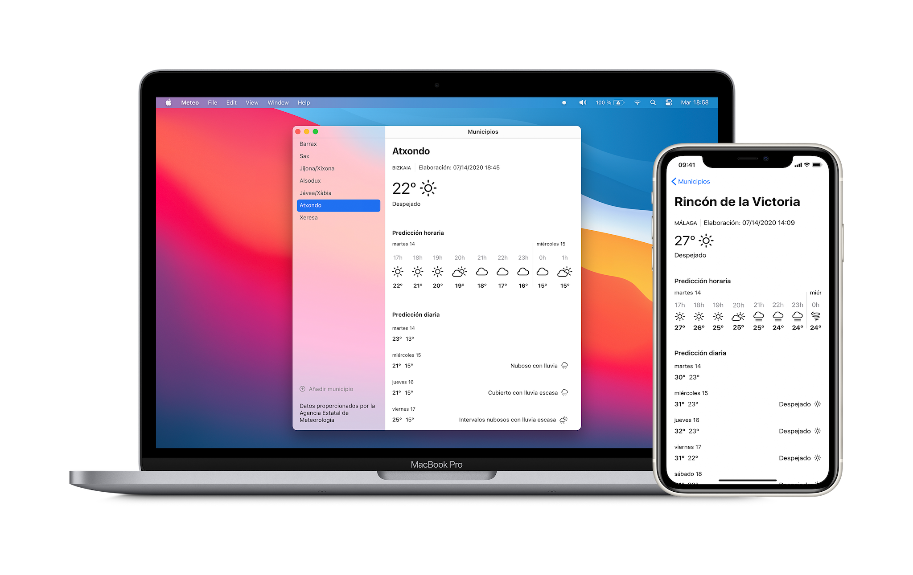

# Meteo - App de meteorología usando datos de la AEMET

Meteo es un proyecto que estoy realizando para aprender SwiftUI.

⚠️ La app no está terminada: ni diseño ni funciones.

Toda sugerencia es bienvenida, siempre que tenga en cuenta las consideraciones anteriores.

## Compilando la app

Se necesita macOS Big Sur Beta, iOS 14 Beta y Xcode 12 Beta.

## Librerías usadas

- [SQLite.swift](https://github.com/stephencelis/SQLite.swift) - Utilizada para almacenar los datos de los municipios

## Autor

- [José María Martín Luque](https://jmml.me)

## Licencia

Este proyecto está licenciado bajo una licencia AGPL.
Consulta el archivo LICENSE.md para más detalles.