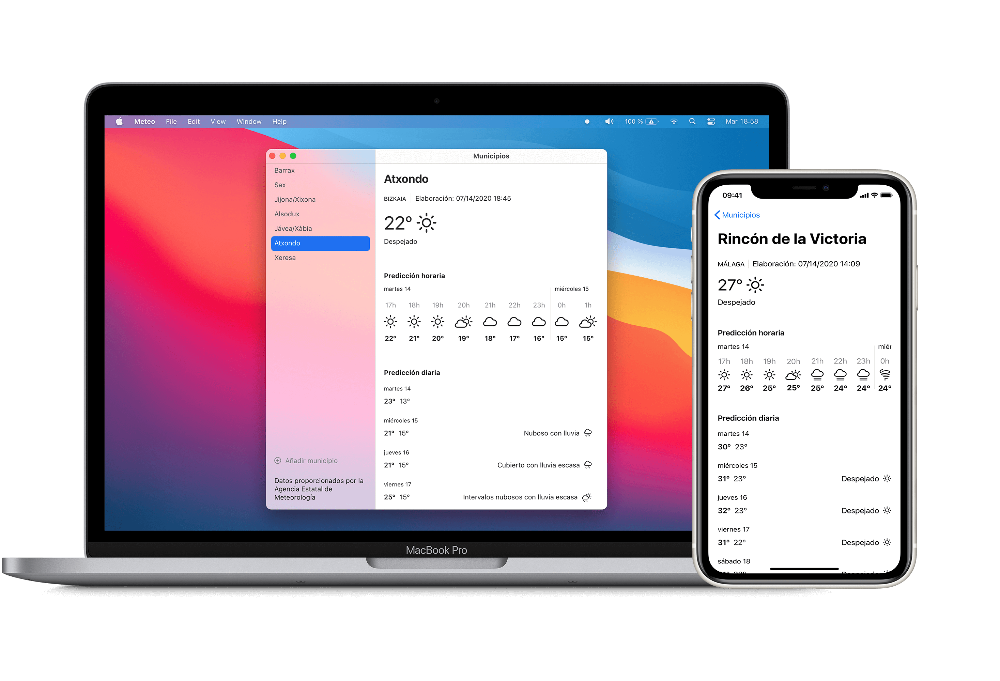

# Meteo - App de meteorología usando datos de la AEMET

Meteo es un proyecto que estoy realizando para aprender SwiftUI.
La app no está terminada: ni diseño ni funciones.

Toda sugerencia es bienvenida, siempre que tenga en cuenta las consideraciones anteriores.